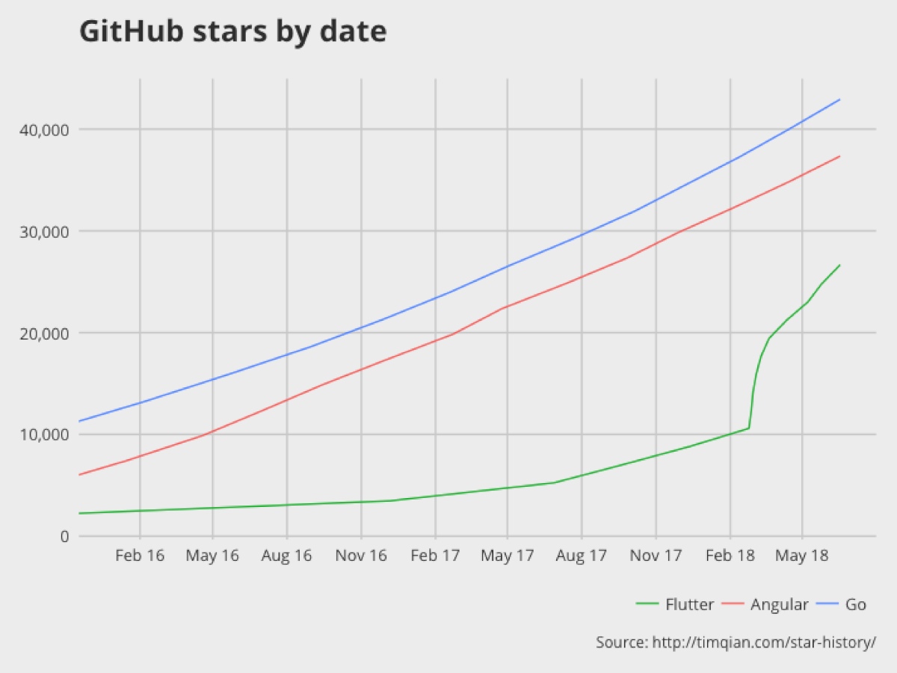

# Flutter

## About

Flutter is an open-source mobile application development SDK created by Google. It is used to develop applications for Android and iOS.

### Flutter engine

Written primarily in C++, provides low-level rendering support using Google's Skia graphics library.

### Advantages

* One code base for two platforms
* Native apps (native performance)
* Material Design and Cupertino widgets, rich motion APIs, smooth natural scrolling, and platform awareness

## Flutter releases

* Initial release: Alpha (v0.0.6) / May 2017
* Preview release: 1.0 / December 4, 2018

## Apps in production

* Alibaba
* Google Ads
* Fuchsia
* and [others](https://itsallwidgets.com/)

### Demo-app "The History of Everything"

* [Google Play](https://play.google.com/store/apps/details?id=com.twodimensions.timeline)

## Flutter development

### IDE's for Flutter

* Visual Studio Code
* Android Studio
* IntelliJ IDEA
* [Flutter Studio (online)](https://flutterstudio.app/)

### Hot reload

### Video

* [Let's live code in Flutter (DartConf 2018)](https://www.youtube.com/watch?v=iflV0D0d1zQ)

## Flutter's future

* [Flare](https://www.2dimensions.com/about-flare)
* Flutter Desktop Embedding (Mac, Linux, Windows, Raspberry Pi)
* Hummingbird (web)

## Flutter's trends

## References

* https://www.dartlang.org/
* https://dartpad.dartlang.org/
* https://flutter.io/
