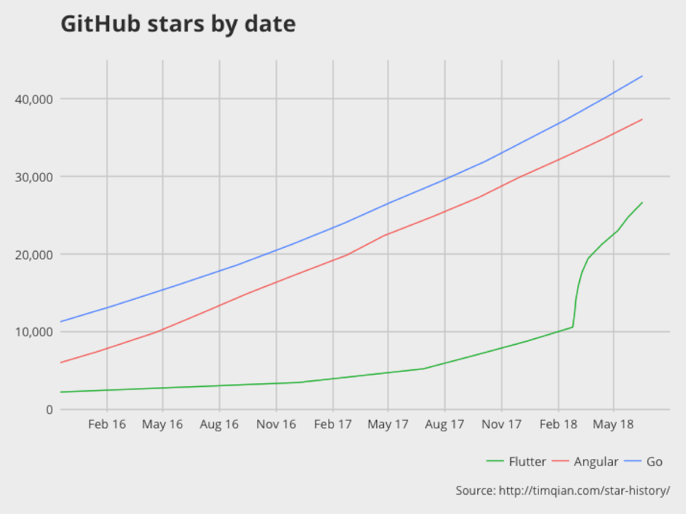

# Flutter

## What is the Flutter

Flutter is an open-source mobile application development SDK created by Google. It is used to develop applications for Android and iOS.

## Development

* Visual Studio Code
* Android Studio
* IntelliJ IDEA
* [Flutter Studio (online)](https://flutterstudio.app/)

## Releases

* Initial release: Alpha (v0.0.6) / May 2017
* Preview release: Beta (v0.4.4) / May 23, 2018

## Prospects

### Advantages

* Performance
* Productive

### Disadvantages

* Beta-status
* Not popular

## References

* https://www.dartlang.org/
* https://dartpad.dartlang.org/
* https://flutter.io/
